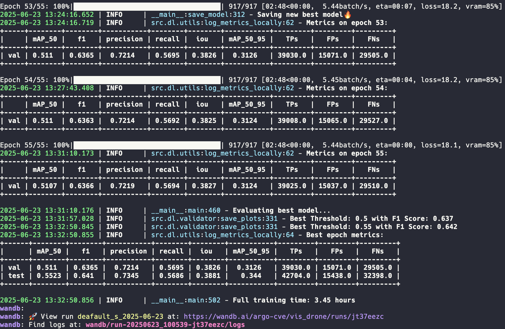
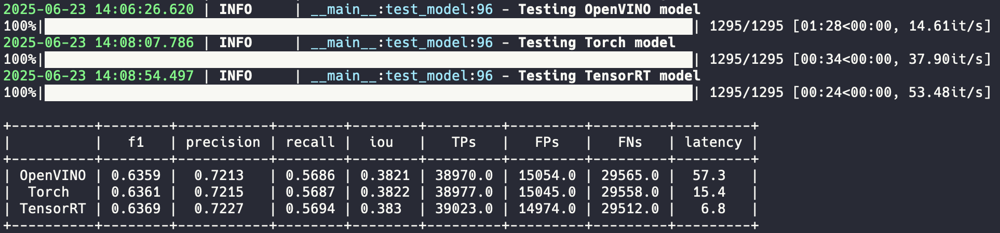
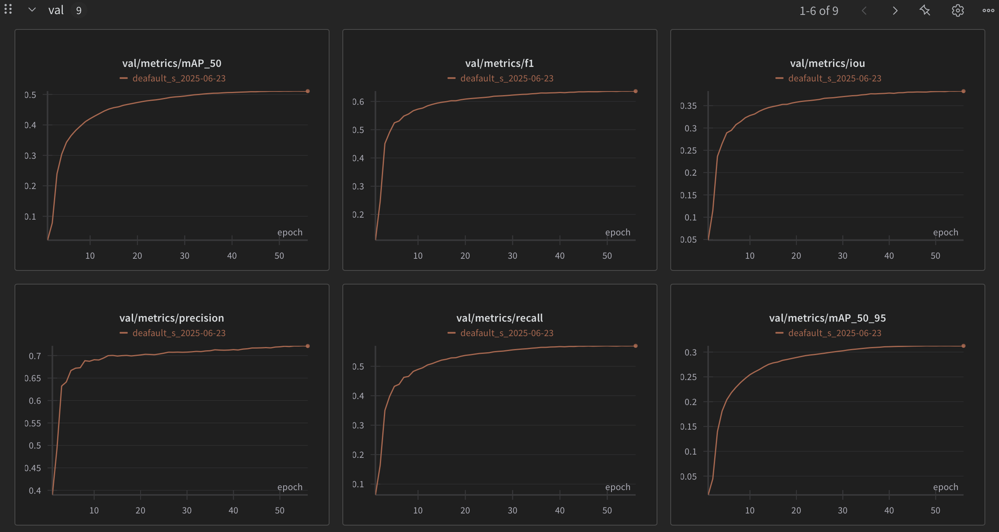
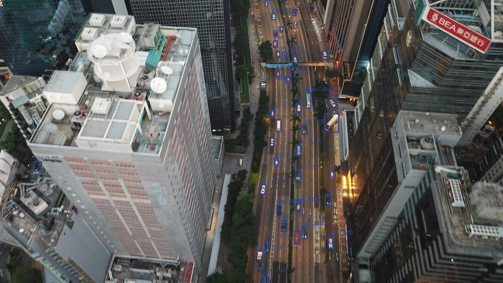
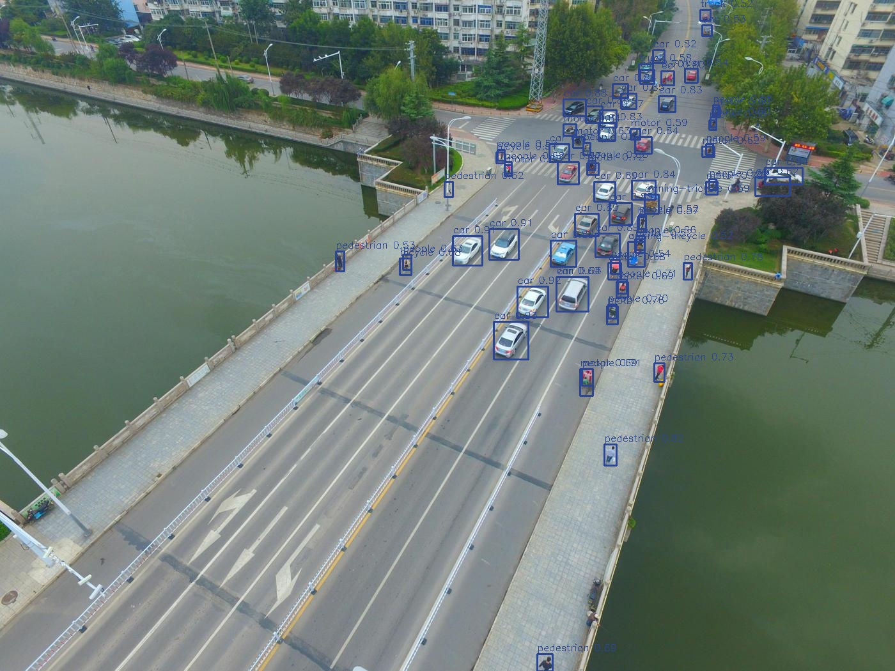

# SoTA Object Detection D-FINE model training, exporting, inferencing pipeline from scratch

This is a custom project to work with [D-FINE](https://arxiv.org/abs/2410.13842) - state of the art object detection transformer based model. Model author's repo: [D-FINE](https://github.com/Peterande/D-FINE).
This is not a fork, but a complete rewrite from scratch. Only model atchitecture and loss functions were used from original repo.

Check out [the tutorial video](https://youtu.be/_uEyRRw4miY) to get familiar with this pipeline.

## Main scripts

To run the scripts, use the following commands:

```bash
python -m src.etl.preprocess    # Converts images and PDFs to JPG format
python -m src.etl.split         # Creates train, validation, and test CSVs with image paths
python -m src.dl.train          # Runs the training pipeline
python -m src.dl.export         # Exports weights in various formats after training
python -m src.dl.bench          # Runs all exported models on the test set
python -m src.dl.infer          # Runs model ontest folder, saves visualisations and txt preds
python -m src.dl.check_errors   # Runs model on train and val sets, saves only missmatched boxes with GT
python -m src.dl.test_batching  # Gets stats to find the optimal batch size for your model and GPU
python -m src.dl.ov_int8        # Runs int8 accuracy aware quantization for OpenVINO. Can take several hours
```

Note: if you don't pass any parameters, you can run any of these scripts with `make script_name`, for exmaple: `make train` will run `python -m src.dl.train`. You can also just run `make` to run `preprocess, split, train, export, bench` scripts as 1 sequence.

## Usage example

0. `git clone https://github.com/ArgoHA/custom_d_fine.git`
1. For bigger models (l, x) download from [gdrive](https://drive.google.com/drive/folders/1cjfMS_YV5LcoJsYi-fy0HWBZQU6eeP-7?usp=share_link) andput into `pretrained` folder
2. Prepare your data: `images` folder and `labels` folder (txt file per image in YOLO format).
```
📂 data/dataset
├── 📁 images
├── 📁 labels
```
3. Customize `config.yaml`, minimal example:
      - `exp_name`. This is experiment name which is used in model's output folder. After you train a model, you can run export/bench/infer and it will use the model under this name + current date.
      - `root`. Path to the directory where you store your dataset and where model outputs will be saved
      - `data_path`. Path to the folder with `images` and `labels`
      - `label_to_name`. Your custom dataset classes
      - `model_name`. Choose from n/s/m/l/x model sizes.
      - and usual things like: epochs, batch_size, num_workers. Check out config.yaml for all configs.
4. Run `preprocess` and `split` scripts from custom_d_fine repo.
5. Run `train` script, changing confurations, iterating, untill you get desired results.
6. Run `export`script to create ONNX, TensorRT, OpenVINO models.

Use `config_.yaml` as a template with default configs.

[Training example with Colab](https://colab.research.google.com/drive/1ZV12qnUQMpC0g3j-0G-tYhmmdM98a41X?usp=sharing)

If you run train script passing the args in the command and not changing them in the config file - you should also pass changed args to other scripts like `export` or `infer`. Example:

```bash
python -m src.dl.train exp_name=my_experiment
python -m src.dl.export exp_name=my_experiment
```

### Train using DDP
If you have multi-gpu hardware, DDP can help train faster. To toggle it, set `ddp` to `True` in config.yaml and use
```console
torchrun --nproc_per_node=auto --master_port=29500 -m src.dl.train
```
It is advised to set `num_workers` as `total logical cpu cores / total gpu cards` for max thoughput.

## Exporting tips

Half precision:

- usually makes sense if your hardware was more FLOPs in fp16
- works best with TensorRT
- for Torch version, AMP is used when Half flag is true, but if FLOPs are the same for fp32 and fp16 - I see AMP being a little slower during inference.
- is not used for OpenVINO, as it automatically picks precision. And it is not used for ONNX.

Dynamic input means that during inference, we cut black paddings from letterbox. I don't recommend using it with D-FINE as accuracy degrades too much (probably because absolute Positional Encoding of patches)

## Inference

Use inference classes in `src/infer`. Currently available:

- Torch
- TensorRT
- OpenVINO
- ONNX

You can run inference on a folder (path_to_test_data) of images or on a folder of videos. Crops will be created automatically. You can control it and paddings from config.yaml in the `infer` section.

## Outputs

- **Models**: Saved during the training process and export at `output/models/exp_name_date`. Includes training logs, table with main metrics, confusion matrics, f1-score_vs_threshold and precisino_recall_vs_threshold. In extended_metrics you can file per class metrics (saved during final eval after all epochs)
- **Debug images**: Preprocessed images (including augmentations) are saved at `output/debug_images/split` as they are fed into the model (except for normalization).
- **Evaluation predicts**: Visualised model's predictions on val set. Includes GT as green and preds as blue.
- **Bench images**: Visualised model's predictions with inference class. Uses all exported models
- **Infer**: Visualised model's predictions and predicted annotations in yolo txt format
- **Check errors**: Creats a folder check_errors with FP and FN bboxes only. Used to check model's errors on training and val sets and to find mislabelled samples.
- **Test batching**: Csv file with all tested batch sizes and latency

## Results examples
**Train**



**Benchmarking**



**WandB**



**Infer**






## Features

- Training pipeline from SoTA D-FINE model
- Export to ONNX, OpenVino, TensorRT.
- Inference class for Torch, TensorRT, OpenVINO on images or videos
- Label smoothing in Focal loss
- Augs based on the [albumentations](https://albumentations.ai) lib
- Mosaic augmentation, multiscale aug
- Metrics: mAPs, Precision, Recall, F1-score, Confusion matrix, IoU, plots
- After training is done - runs a test to calculate the optimal conf threshold
- Exponential moving average model
- Batch accumulation
- Automatic mixed precision (40% less vRAM used and 15% faster training)
- Gradient clipping
- Keep ratio of the image and use paddings or use simple resize
- When ratio is kept, inference can be sped up with removal of grey paddings
- Visualisation of preprocessed images, model predictions and ground truth
- Warmup epochs to ignore background images for easier start of convirsion
- OneCycler used as scheduler, AdamW as optimizer
- Unified configuration file for all scrips
- Annotations in YOLO format, splits in csv format
- ETA displayed during training, precise strating epoch 2
- Logging file with training process
- WandB integration
- Batch inference
- Early stopping
- Gradio UI demo

## TODO

- Finetune with layers freeze
- Add support for cashing in dataset
- Add support for multi GPU training
- Instance segmentation
- Smart dataset preprocessing. Detect small objects. Detect near duplicates (remove from val/test)


## Acknowledgement

This project is built upon original [D-FINE repo](https://github.com/Peterande/D-FINE). Thank you to the D-FINE team for an awesome model!

``` bibtex
@misc{peng2024dfine,
      title={D-FINE: Redefine Regression Task in DETRs as Fine-grained Distribution Refinement},
      author={Yansong Peng and Hebei Li and Peixi Wu and Yueyi Zhang and Xiaoyan Sun and Feng Wu},
      year={2024},
      eprint={2410.13842},
      archivePrefix={arXiv},
      primaryClass={cs.CV}
}
```
